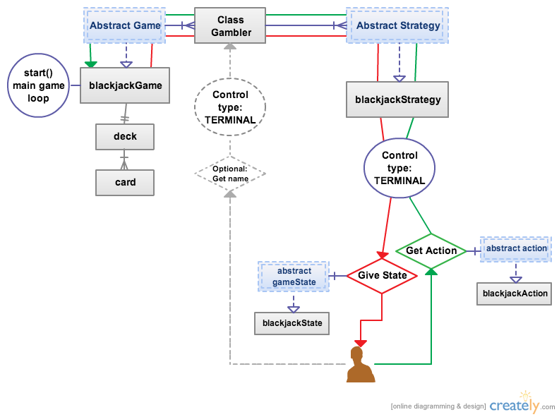

A Casino games framework
------------------------------

##Classes:

###card
A simple playing card

###deck
A deck of cards. Could consist of more than one normal deck, but all the cards will be held in one container, and shuffled together. The main functions are:
- Shuffling
- Dealing, which will remove one card from the "top" of the deck.

###gambler
Not abstract, and not polymorphic. Instead of having gamblers of different subtypes, each gambler has a polymorphic vector of *strategies*, enabling the same gambler to play different types of games. The gamblers main features are:
- *strategies*, as mentioned
- cash, which can be won and lost
- A name
- A unique numerical ID (Should be derived from the static playerCount)
- A *control type*. The type "TERMINAL" must be implemented as default, others are for possible future use. The idea is that a gambler with controlType "TERMINAL", will be controlled by a human being, through the terminal. In this case, the gamblers name should be set by the user through the terminal, and every decision should be fetched from the user, via the standard input. Later, the idea is that one can mix human players on the local computer or over a network, or by the computer, i.e. by bots, locally or also over the network. 

###strategy
*Abstract* class, to be subclassed into blackjackStrategy, pokerStrategy etc., expected to be polymorphic
- A strategy's main function is to decide on an action, or move, in a game, based on the current *game state*. This is done via the *takeAction* function
- A *Gambler* has a vector of strategies  

###game
*Abstract* class,expected to be subclassed and polymorphic. 

- A *game* is intended to be one run-through of a game, of a certain *gameType*, played until a winner/winners can be determined. For blackjack, this would typycally be at least one round of blackjack, but it could also be several rounds, played until there are no players left at the table, or until each player, or the dealer is out of cash.
- It contains a vector of *gamblers*, i.e. players. The idea is that the game will send *gameState* to each gambler, and get their *action*, until a winner can be determined.
- A game must contain a *gameType*, which later could be used to make it polymorphic, i.e. make it possible to keep several types of games in the same vector, and to start and monitor them through there. 

###blackjackGame
Concrete class, subclass of *game*. To be written.

###gameState
*Abstract* and expected to be polymorphic. The *game state* should contain a snapshot of all the information available to a player at a point in time, sufficient for the player to take action/make a move. For chess this would be the chessboard with the position of all the pieces, for blackjack this would be the cards each player, including the dealer, holds. 
- Remembering previous game states is not required or supported by the current design. 
  --This means that remembering what other players have done earlier in the game, or even in previous games, counting cards in blackjack, adapting to the opponents playing style in chess etc. is not yet supported or required. 
  --This could be done inside the strategy object, or in a kind of game history object local to the gambler, but, this is *not* included in the current design. 
  --This should never be included in the gameState object - the intention of the gameState class is just to show what the game looks like right now.

###blackjackState
Subclass of *gameState*, containing all the information necessary to make a decision in blackjack. 
- The main thing here is to get the players own cards, and the dealers cards
- The function 
- It does contain the cards currently held by each player, but this it is not necessary to use this information. It's just there to make it possible to implement card counting etc. later. 

###action
*Abstract*, expected to be polymorphic. A players action, decided (and returned) by a strategy object. The most important property of this general action class, is the *gameType*, which will make it possible to identify the subtype.
- The only reason to have a general action class, is that there exists a general strategy class, with a member function "takeAction". This has to have a general return type for there to be any point of a general strategy class.
